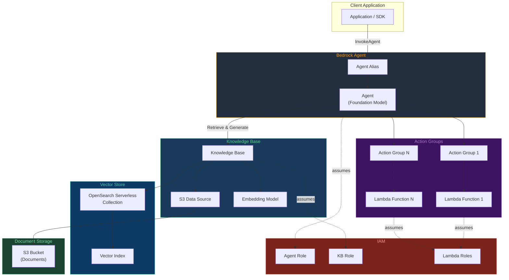
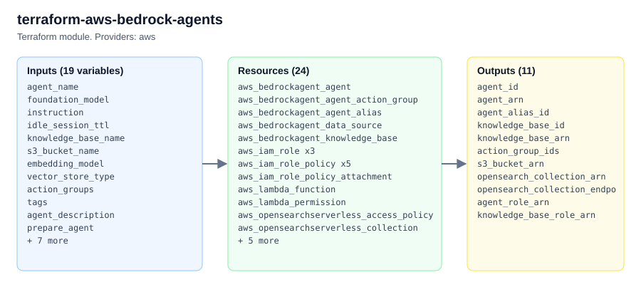

# terraform-aws-bedrock-agents

Terraform module for provisioning **AWS Bedrock Agents** -- autonomous AI agents that execute multi-step tasks using foundation models, APIs, and knowledge bases. This module creates the agent, knowledge base backed by OpenSearch Serverless, S3 data sources, action groups with Lambda functions, and all required IAM roles.

---

## Architecture



---

## Documentation

- [Amazon Bedrock Agents User Guide](https://docs.aws.amazon.com/bedrock/latest/userguide/agents.html)
- [Terraform aws_bedrockagent_agent Resource](https://registry.terraform.io/providers/hashicorp/aws/latest/docs/resources/bedrockagent_agent)
- [Amazon Bedrock Knowledge Bases](https://docs.aws.amazon.com/bedrock/latest/userguide/knowledge-base.html)

---

## Prerequisites

1. **Terraform** >= 1.5.0
2. **AWS Provider** >= 5.40.0
3. **AWS CLI** configured with credentials that have permissions for Bedrock, IAM, S3, Lambda, and OpenSearch Serverless.
4. **Foundation model access** enabled in the AWS Bedrock console for the desired model (e.g., `anthropic.claude-3-sonnet-20240229-v1:0`).
5. **Embedding model access** enabled for the chosen embedding model (e.g., `amazon.titan-embed-text-v2:0`).
6. The target AWS region must support Amazon Bedrock Agents (check [regional availability](https://docs.aws.amazon.com/bedrock/latest/userguide/bedrock-regions.html)).

---

## Usage Example

```hcl
module "bedrock_agent" {
  source = "github.com/kogunlowo123/terraform-aws-bedrock-agents"

  agent_name       = "customer-support-agent"
  foundation_model = "anthropic.claude-3-sonnet-20240229-v1:0"
  instruction      = <<-EOT
    You are a customer support agent. Help users by looking up order information
    and answering questions from the knowledge base. Always be polite and concise.
  EOT

  knowledge_base_name = "support-kb"
  s3_bucket_name      = "my-company-support-docs-kb"
  embedding_model     = "amazon.titan-embed-text-v2:0"
  vector_store_type   = "OPENSEARCH_SERVERLESS"

  action_groups = [
    {
      name              = "order-lookup"
      description       = "Look up order status and details"
      lambda_source_dir = "${path.module}/lambdas"
      lambda_handler    = "action_group_handler.handler"
      api_schema_payload = jsonencode({
        openapi = "3.0.0"
        info    = { title = "Order API", version = "1.0.0" }
        paths = {
          "/lookup" = {
            get = {
              operationId = "lookupOrder"
              description = "Look up an order by ID"
              parameters = [
                {
                  name        = "query"
                  in          = "query"
                  required    = true
                  schema      = { type = "string" }
                  description = "The order ID to look up"
                }
              ]
              responses = {
                "200" = { description = "Order details" }
              }
            }
          }
        }
      })
    }
  ]

  tags = {
    Environment = "production"
    Team        = "platform"
  }
}
```

---

## Deployment Guide

### Step 1 -- Prepare the Environment

```bash
# Clone the repository
git clone https://github.com/kogunlowo123/terraform-aws-bedrock-agents.git
cd terraform-aws-bedrock-agents

# Ensure the AWS CLI is configured
aws sts get-caller-identity
```

### Step 2 -- Enable Model Access

Open the [Amazon Bedrock console](https://console.aws.amazon.com/bedrock/), navigate to **Model access**, and request access for:
- The foundation model specified in `foundation_model`
- The embedding model specified in `embedding_model`

### Step 3 -- Create a Terraform Configuration

Create a `main.tf` in your working directory that calls this module (see the usage example above). Provide a `terraform.tfvars` or pass variables on the command line.

### Step 4 -- Initialize and Plan

```bash
terraform init
terraform plan -out=tfplan
```

Review the plan output carefully. Verify that the agent, knowledge base, OpenSearch collection, S3 bucket, Lambda functions, and IAM roles match your expectations.

### Step 5 -- Apply

```bash
terraform apply tfplan
```

### Step 6 -- Upload Documents to S3

```bash
aws s3 cp ./docs/ s3://<your-bucket-name>/ --recursive
```

### Step 7 -- Sync the Knowledge Base

After uploading documents, trigger a data source sync through the Bedrock console or CLI:

```bash
aws bedrock-agent start-ingestion-job \
  --knowledge-base-id <knowledge_base_id> \
  --data-source-id <data_source_id>
```

### Step 8 -- Test the Agent

Use the Bedrock console **Test** pane or invoke the agent via the AWS SDK:

```bash
aws bedrock-agent-runtime invoke-agent \
  --agent-id <agent_id> \
  --agent-alias-id <agent_alias_id> \
  --session-id "test-session-001" \
  --input-text "What is the status of order 12345?"
```

---

## Inputs

| Name | Description | Type | Default | Required |
|------|-------------|------|---------|----------|
| `agent_name` | Name of the Bedrock Agent | `string` | n/a | yes |
| `foundation_model` | Foundation model identifier for the agent | `string` | `"anthropic.claude-3-sonnet-20240229-v1:0"` | no |
| `instruction` | Instruction prompt that defines the agent's behavior | `string` | n/a | yes |
| `idle_session_ttl` | Idle session TTL in seconds | `number` | `600` | no |
| `knowledge_base_name` | Name of the knowledge base | `string` | n/a | yes |
| `s3_bucket_name` | S3 bucket name for knowledge base documents | `string` | n/a | yes |
| `embedding_model` | Embedding model ARN for the vector store | `string` | `"amazon.titan-embed-text-v2:0"` | no |
| `vector_store_type` | Vector store type (`OPENSEARCH_SERVERLESS` or `PINECONE`) | `string` | `"OPENSEARCH_SERVERLESS"` | no |
| `action_groups` | List of action group configurations | `list(object)` | `[]` | no |
| `tags` | Map of tags to apply to all resources | `map(string)` | `{}` | no |
| `agent_description` | Description of the Bedrock Agent | `string` | `""` | no |
| `prepare_agent` | Whether to prepare the agent after creation | `bool` | `true` | no |
| `knowledge_base_description` | Description of the knowledge base | `string` | `"Knowledge base for Bedrock Agent"` | no |
| `s3_data_source_prefix` | S3 key prefix for data source inclusion | `string` | `""` | no |
| `opensearch_collection_name` | Name for the OpenSearch Serverless collection | `string` | `""` | no |
| `vector_index_name` | Name of the vector index | `string` | `"bedrock-knowledge-base-index"` | no |
| `vector_field_name` | Name of the vector field in the index | `string` | `"embedding"` | no |
| `text_field` | Name of the text field in the index | `string` | `"text"` | no |
| `metadata_field` | Name of the metadata field in the index | `string` | `"metadata"` | no |

## Outputs

| Name | Description |
|------|-------------|
| `agent_id` | The unique identifier of the Bedrock Agent |
| `agent_arn` | The ARN of the Bedrock Agent |
| `agent_alias_id` | The unique identifier of the agent alias |
| `knowledge_base_id` | The unique identifier of the knowledge base |
| `knowledge_base_arn` | The ARN of the knowledge base |
| `action_group_ids` | Map of action group names to their IDs |
| `s3_bucket_arn` | The ARN of the S3 bucket for the knowledge base |
| `opensearch_collection_arn` | The ARN of the OpenSearch Serverless collection |
| `opensearch_collection_endpoint` | The endpoint of the OpenSearch Serverless collection |
| `agent_role_arn` | The ARN of the IAM role used by the Bedrock Agent |
| `knowledge_base_role_arn` | The ARN of the IAM role used by the Knowledge Base |

---

## License

MIT License. See [LICENSE](LICENSE) for details.

<!-- project-structure -->
## Project structure

```text
├── .github/
├── docs/
│   └── architecture.html
├── examples/
│   └── complete/
├── lambdas/
│   └── action_group_handler.py
├── tests/
│   ├── main.tf
│   ├── outputs.tf
│   └── providers.tf
├── .editorconfig
├── .gitattributes
├── CHANGELOG.md
├── CODEOWNERS
├── CONTRIBUTING.md
├── LICENSE
├── README.md
├── SECURITY.md
├── main.tf
├── outputs.tf
├── variables.tf
└── versions.tf
```

<!-- architecture -->
## Architecture


